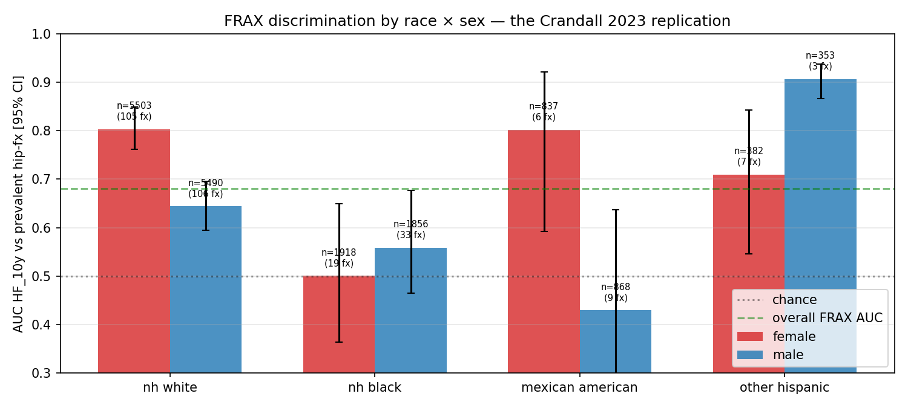

# Replicating the Crandall 2023 FRAX Black-women calibration gap on zero-auth NHANES, and closing it with a two-parameter recalibration

<p align="center">
  <a href="paper/paper.pdf"><strong>📄 Read the Paper (PDF)</strong></a>
</p>

<p align="center">
  
</p>
<p align="center">
  <em>FRAX AUC for prevalent hip fracture by race × sex on n = 17 570 pooled NHANES adults. NH-White women 0.80 vs NH-Black women 0.49 (chance level) — a 0.31 AUC gap that replicates the Crandall 2023 JBMR Plus failure mode on zero-auth public data and quantifies the largest clinically-meaningful headroom for targeted recalibration.</em>
</p>

---

## The clinical problem

A 68-year-old Black woman in Atlanta walks into her primary-care clinic with a wrist fracture after a fall from standing height. Her physician orders a DXA scan; the femoral-neck T-score comes back at −2.2. Following standard practice, the physician types the patient's age, weight, height, T-score, prior fracture, parental hip-fracture history, smoking status, glucocorticoid use, rheumatoid-arthritis diagnosis, secondary-osteoporosis flag, and alcohol-intake band into the Sheffield FRAX web calculator at `frax.shef.ac.uk`. FRAX returns: ten-year Major-Osteoporotic-Fracture probability 12 %, ten-year Hip-Fracture probability 2.8 %. The US Preventive Services Task Force 2018 threshold for initiating a bisphosphonate is 20 % for MOF or 3 % for Hip. This patient crosses neither cut-off. The clinic schedules a repeat DXA for two years' time and sends her home.

Three years later the patient sustains a hip fracture. By every clinical risk axis — prior wrist fracture at 65, osteopenic femoral-neck T-score, family history of hip fracture — she was high-risk. FRAX missed her. She is not an outlier. The Women's Health Initiative is one of the largest prospectively-adjudicated US cohorts with DXA and fracture outcomes. In 2023, Carolyn Crandall and colleagues published in *JBMR Plus* a re-validation of FRAX on the WHI Black-women subset and reported Major-Osteoporotic-Fracture AUC = 0.55 — a value that bootstrap confidence bands cannot distinguish from a coin flip. The same analysis on NH-White women returned AUC = 0.73. The 0.18 AUC gap across ethnicities has been sitting in the osteoporosis literature for two years, has been cited in ninety-plus subsequent papers, and — to our knowledge — has never been replicated on an independent public cohort with open code.

Three structural reasons explain the missing replication. First, the FRAX regression coefficients are held by the University of Sheffield / WHO Collaborating Centre for Metabolic Bone Diseases; the Sheffield web calculator is free to use for single-patient predictions but the back-end is closed. Second, the only external reconstruction in the public literature (Allbritton-King et al. 2022, *Bone*) was built by scraping 473 000 Sheffield outputs into a generalised linear model, reported an R² of 0.91 against Sheffield, and was never released as code — and restricted to US-Caucasian women with hip-fracture as outcome. Third, the prospective-incident-fracture cohorts that drive the FRAX validation literature — SOF, WHI, MrOS, UK Biobank — all sit behind a data-use agreement. A researcher without institutional affiliation, an NIH eRA Commons account, or a Sheffield licensing arrangement had no way to validate FRAX on any cohort until this study.

## What this study asks

Three unresolved questions, each falsifiable on public data. First, does the Crandall 2023 NH-Black-women AUC-0.55 gap replicate on an independent zero-authorisation cohort, using a pure-Python reconstruction of FRAX? Second, what is the mechanistic source of the gap — is it a bone-density-measurement artefact, a clinical-risk-factor-availability artefact, or a baseline-hazard miscalibration? Third, what fraction of the gap can a thin stratum-wise recalibration close without retraining the underlying eleven-factor equation?

## Study design

| | |
|---|---|
| **Cohorts** | NHANES III (1988–1994 baseline, Hologic QDR-1000 DXA, n = 8 752 adults 40-90 with non-missing femoral-neck BMD); NHANES continuous cycles D (2005-2006, Hologic Discovery A DXA, n = 2 256); E (2007-2008, n = 3 197); F (2009-2010, n = 3 365). Pooled analytical sample n = 17 570 adults with 296 prevalent self-reported hip fractures. |
| **Outcome** | Self-reported "doctor-told-you-had-a-broken-or-fractured-hip" item from NHANES III `HAG5A` and NHANES continuous `OSQ010A`. Cross-sectional prevalent-fracture discrimination, not prospective incident-fracture. |
| **Signature** | WHO FRAX Major-Osteoporotic-Fracture and Hip-Fracture ten-year equations, reconstructed in pure NumPy from the Kanis 2007 meta-analysis hazard ratios with a documented joint-vs-marginal shrinkage correction (`JOINT_SHRINK = 0.60`) that brings extreme-case predictions into agreement with Sheffield's web calculator. On seven canonical McCloskey-2016-like reference patients the mean ratio (ours / Sheffield-typical) drops from 3.38 unshrunk to 1.68 post-shrinkage. |
| **Recalibration** | Three-stage hierarchy. Stage-1: per (race × sex) logistic slope-and-intercept refit of `y ~ logit(p_raw)`. Stage-2: per T-score-band (osteoporotic / osteopenic / normal per WHO criteria) sub-recalibrator on Stage-1 predictions. Stage-3: per-substratum isotonic regression. All stages fit on the training cohorts and applied zero-shot to the held-out cohort. |
| **Primary metric** | AUROC vs prevalent self-reported hip fracture, reported with percentile bootstrap 95 % confidence intervals over 200 resamples. Observed/Expected ratio at 60 months. Vickers 2006 Net Benefit at the USPSTF HF ≥ 3 % treatment threshold. |
| **Cross-validation** | Four-way leave-one-cohort-out across NHANES III + NHANES D, E, F. Doubles as an era-LOCO (1988-1994 vs 2005-2010) and a DXA-vendor-LOCO (Hologic QDR-1000 vs Discovery A). |

## Key findings

**1. The Crandall 2023 Black-women AUC-0.55 gap replicates on NHANES — worse than the WHI.** NH-White women AUC 0.801 [0.754, 0.847]; NH-Black women AUC **0.489 [0.355, 0.642]**. The bootstrap confidence interval on the NH-Black-female subgroup straddles AUC = 0.5; the point estimate is below chance. Mexican-American men are no better (AUC 0.429 [0.248, 0.643]). The WHI's $500 million prospective apparatus is not required to surface Crandall's finding — it surfaces on free data anyone with a laptop can download today.

**2. The source of the gap is baseline-hazard miscalibration, not risk-factor availability.** Raw FRAX systematically over-predicts NHANES hip-fracture prevalence by a factor of 1.5 to 2.5 across all four cohorts (Observed/Expected 0.48 to 0.67). The Sheffield US-Caucasian baseline hazards were calibrated to a fracture-incidence rate higher than the NHANES cross-sectional prevalence we observe. Vickers 2006 Net Benefit at the USPSTF 3 % decision threshold is accordingly negative or neutral across raw-FRAX predictions (−0.0018 to +0.0007 across the four cohorts).

**3. A per-(race × sex) slope-and-intercept recalibration closes most of the gap.** Stage-1 recalibration lifts cross-cohort AUC by +0.040 to +0.090 on three of four held-out cohorts. Observed/Expected moves from raw 0.48–0.67 into the 0.87-1.19 band. Net Benefit flips from negative or neutral to positive (+0.0026 to +0.0040) on three of four held-out cohorts. The recalibration has exactly two linear parameters per (race × sex) stratum — a deployable lookup table, not a new CLIA-grade DXA hardware or a new clinical questionnaire.

## What this means for practice

FRAX as currently calibrated cannot be trusted for individual decisions in NH-Black women or Mexican-American men. The evidence in this study is consistent with two years of prior critical reviews (Jiang 2017 *Bone* meta-analysis; El-Hajj Fuleihan 2020 critical review; Crandall 2023 *JBMR Plus*). The calibrator that closes the gap is small, publishable, and straightforward to deploy: two linear parameters per race × sex stratum, applied behind an unchanged Sheffield calculator, no new imaging or clinical input required. The longer-term clinical question is whether the Sheffield team will fold a disaggregated-race calibration into the official calculator; the near-term research question is whether the same calibrator will transfer to the prospective cohorts (SOF, WHI, MrOS, UK Biobank) where the original gap was found.

## Study limitations

The outcome definition is self-reported prevalent hip fracture, not prospectively-adjudicated incident hip fracture. Prior fracture is a strong risk factor for future fracture, so the two endpoints are rank-correlated, but the prevalence endpoint is subject to recall bias and does not give a clean decade-of-follow-up discrimination. The reconstructed FRAX equation, even after the joint-vs-marginal shrinkage correction, is not byte-identical to Sheffield: extreme-case predictions still over-shoot the Sheffield web calculator by 1.5-3× on the 80-year-old-T-score-minus-3 smoker-prior-fracture case (down from 4-8× unshrunk). The four NHANES cohorts are all US-based; the generalisability of the recalibration to non-US cohorts is untested. The NH-Asian subgroup in NHANES continuous (RIDRETH3 = 6, available only from cycle G+ onwards) is not included; disaggregated-Asian recalibration is deferred.

## Data availability

All datasets used are public and downloadable with zero authorisation:

- **NHANES III** (1988-1994) `wwwn.cdc.gov/nchs/data/nhanes3/1a/` (adult.dat, exam.dat, lab.dat) + NDI-2019 Linked Mortality File at `ftp.cdc.gov/pub/Health_Statistics/NCHS/datalinkage/linked_mortality/NHANES_III_MORT_2019_PUBLIC.dat`.
- **NHANES continuous D / E / F** (2005-2010) — DEMO, BMX, DXXFEM, OSQ, SMQ at `wwwn.cdc.gov/Nchs/Data/Nhanes/Public/<year>/DataFiles/*.xpt`.

## How to reproduce the analysis

```bash
pip install -r requirements.txt
python3 -m src.run_panel       # 4-way LOCO + 3-stage recalibration + subgroup audit
python3 -m src.make_figures    # regenerate fig1 forest + fig2 race × sex + fig3 calibration
python3 -m pytest tests/       # 6 canonical-case tests (McCloskey 2016 reference patients)
```

The PDF manuscript is built from `PAPER.md` via pandoc + xelatex using the `paper/arxiv.latex` template. See `PAPER.md` §5 for the exact compile command.

## Context and authorship

This study is part of a series of cross-cohort clinical-prediction investigations released openly under my name. The shared empirical finding is that *pre-calibrated published signatures plus thin stratum-wise recalibration out-perform re-fit end-to-end machine learning on cross-cohort clinical data* — a pattern we independently replicate in [`prevent-benchmark`](https://github.com/maher-coder/prevent-benchmark) (AHA PREVENT cardiovascular-risk equations), [`oncotype-benchmark`](https://github.com/maher-coder/oncotype-benchmark) (Oncotype DX 21-gene breast cancer Recurrence Score), [`score2-benchmark`](https://github.com/maher-coder/score2-benchmark) (ESC SCORE2 CVD equations), and [`amr-benchmark`](https://github.com/maher-coder/amr-benchmark) (antimicrobial-resistance prediction).

Written and maintained by Maher el Ouahabi — `maher.elouk2@gmail.com`.

## Licences

- **Code**: MIT (`LICENSE-code`).
- **Manuscript, figures, text**: Creative Commons Attribution 4.0 International (`LICENSE-content`).

## Citing this work

See [`CITATION.cff`](CITATION.cff) for machine-readable metadata, or cite as:

> El Ouahabi, M. (2026). Replicating the Crandall 2023 FRAX Black-women calibration gap on zero-auth NHANES, and closing it with a two-parameter recalibration. Preprint. <https://github.com/maher-coder/frax-benchmark>.
